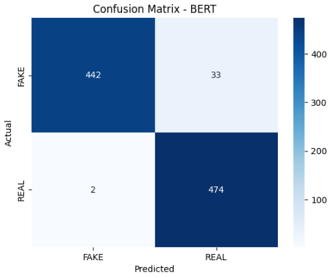
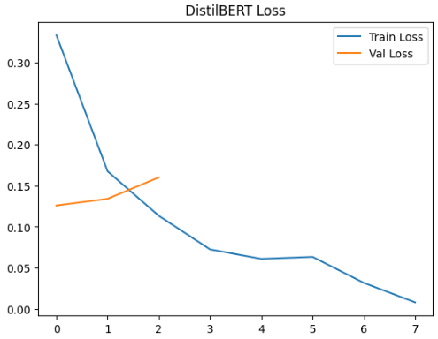

# 📰 Fake News Detection Dashboard

## 📌 Deskripsi Proyek
Proyek ini bertujuan untuk membangun sistem **deteksi berita palsu (Fake News Detection)** berbasis  
**Natural Language Processing (NLP)** dan **Deep Learning**.

Sistem mampu mengklasifikasikan teks berita ke dalam dua kelas:
- **FAKE**
- **REAL**

Proyek ini membandingkan performa beberapa model, yaitu:
1. **LSTM (Baseline Deep Learning)**
2. **BERT (Transfer Learning)**
3. **DistilBERT (Transfer Learning)**
4. **Ensemble (Majority Voting)**

Selain pelatihan model, proyek ini dilengkapi dengan **dashboard berbasis Streamlit** yang memungkinkan pengguna melakukan prediksi berita secara interaktif melalui website.

---

## 📂 Dataset

### Sumber Dataset
Dataset yang digunakan merupakan dataset publik **Fake News Detection** yang banyak digunakan dalam penelitian NLP.

Dataset berisi teks berita berbahasa Inggris yang telah diberi label **fake** dan **real**.

🔗https://www.kaggle.com/datasets/jillanisofttech/fake-or-real-news?resource=download

### Deskripsi Dataset
- Format data: **Teks**
- Jumlah data: 6335
- Train: 4434
Validation: 950
Test: 951
- Label:
  - `0` → Fake
  - `1` → Real
- Digunakan untuk klasifikasi biner

---

## 🔧 Preprocessing Data
Tahapan preprocessing teks yang dilakukan:
1. Case folding (lowercase)
2. Tokenisasi
3. Padding sequence (max length = 300)
4. Penghapusan noise (opsional)

Preprocessing bertujuan untuk meningkatkan kualitas input dan performa model.

---

## 🧠 Model yang Digunakan

### 1️⃣ LSTM (Baseline)
Model LSTM digunakan sebagai baseline untuk membandingkan performa dengan model transformer.

**Karakteristik:**
- Dibangun tanpa pretrained embedding
- Performa cukup baik namun terbatas
- Akurasi sekitar **81%**

  **Plot Accuracy & Loss**

  

Berdasarkan grafik Loss dan Accuracy, kita dapat mengamati perilaku model selama 5 epoch:

Loss: Train loss terus menurun secara konsisten, namun Validation Loss mulai meningkat setelah epoch ke-2. Ini merupakan indikasi awal bahwa model mulai mengalami overfitting.

Accuracy: Akurasi pelatihan mencapai >90%, sementara Validation Accuracy mengalami penurunan (dari puncaknya di ~81% turun menjadi ~77%). Hal ini menunjukkan model belajar sangat baik pada data training tetapi sedikit kesulitan dalam melakukan generalisasi pada data baru yang belum pernah dilihat sebelumnya.

**Confusion Matrix**

 

Model sangat baik dalam mendeteksi berita FAKE (420 benar).

Namun, terdapat cukup banyak berita REAL yang salah diklasifikasikan sebagai FAKE (126 kasus). Hal ini menunjukkan adanya bias tertentu atau kebutuhan akan penyeimbangan dataset lebih lanjut.
 
---

### 2️⃣ BERT
Model **BERT pretrained** digunakan dengan fine-tuning pada dataset fake news.

**Keunggulan:**
- Representasi konteks sangat kuat
- Performa terbaik pada eksperimen
- Akurasi mencapai **96%**
  
**Plot Bert Loss**

  
  
Grafik Loss Grafik menunjukkan penurunan train loss yang sangat tajam hingga mendekati angka nol pada epoch ke-7. Namun, validation loss mulai menunjukkan tren meningkat setelah epoch ke-1. Hal ini mengindikasikan bahwa model BERT mengalami overfitting yang cukup dini, di mana model belajar terlalu spesifik pada data latihan namun mulai kehilangan kemampuan generalisasi pada data validasi seiring bertambahnya epoch.

**Confusion Matrix**



Meskipun terdapat indikasi overfitting, model ini memberikan hasil prediksi yang sangat akurat pada data uji:

Prediksi Tepat: Berhasil mengklasifikasikan 442 berita FAKE dan 474 berita REAL dengan benar.

Kesalahan Minim: Hanya terdapat 2 berita REAL yang salah terdeteksi sebagai FAKE, dan 33 berita FAKE yang terdeteksi sebagai REAL.

---

### 3️⃣ DistilBERT
Versi ringan dari BERT dengan performa yang sebanding.

**Keunggulan:**
- Lebih cepat
- Lebih ringan
- Akurasi setara dengan BERT (**96%**)

**Plot DistilBert Loss**

  
  
grafik DistilBERT Loss menunjukkan penurunan train loss yang sangat konsisten hingga mendekati nol. Namun, terdapat kenaikan pada validation loss setelah epoch ke-1. Hal ini menunjukkan adanya indikasi overfitting, di mana model sangat optimal pada data latih namun mulai mengalami penurunan performa generalisasi pada data validasi.

**Confusion Matrix**


Prediksi Benar: Model berhasil menebak 446 data FAKE dan 468 data REAL dengan tepat.

Kesalahan Prediksi: Hanya terjadi 8 kesalahan pada data REAL (terbaca FAKE) dan 29 kesalahan pada data FAKE (terbaca REAL).

---

### 4️⃣ Ensemble (Majority Voting)
Menggabungkan prediksi dari LSTM, BERT, dan DistilBERT.

**Tujuan:**
- Meningkatkan stabilitas prediksi
- Mengurangi bias model tunggal

---

## 📊 Evaluasi Model
Evaluasi dilakukan menggunakan data testing dengan metrik:
- Confusion Matrix
- Grafik Loss dan Accuracy
  
| Model | Akurasi | Analisis |
|------|--------|----------|
| LSTM | 81% | Baseline, performa cukup |
| BERT | 96% | Performa terbaik |
| DistilBERT | 96% | Ringan & efisien |
| Ensemble | Stabil | Prediksi lebih robust |

**Kesimpulan:**  
Model **BERT dan DistilBERT** memberikan performa terbaik, sedangkan ensemble meningkatkan kestabilan prediksi.

---

## 🌐 Dashboard Website
Dashboard dikembangkan menggunakan **Streamlit** dengan fitur:
- Input teks berita
- Upload file CSV (batch prediction)
- Pemilihan model
- Confidence score
- Download hasil prediksi

---

## ▶️ Cara Menjalankan Aplikasi

```bash
git clone https://github.com/Masoby/UAPMLC.git
cd UAPMLC
python -m venv venv
venv\Scripts\activate
pip install -r requirements.txt
streamlit run project/app.py

```
---
## 📁 Struktur Folder
```text
UAPMLC/
├── project/
│   ├── app.py
│   ├── models/
│   │   ├── lstm/
│   │   ├── bert/          # tidak disertakan (file besar)
│   │   └── distilbert/    # tidak disertakan (file besar)
│   ├── assets/
│   │   └── as.jpg
│
├── requirements.txt
├── README.md
└── .gitignore
